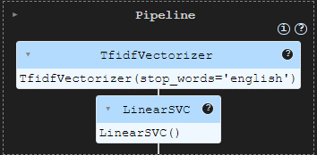
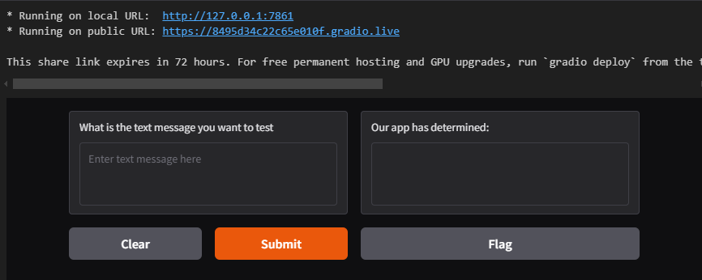

# sms_spam_detector
Module 21 Challenge - SMS Text Classification with Gradio App

This challenge is an integration exercise to build a simple Gradio front-end for a SMS text message classification solution.

## SMS Text Message Classification Model
This model is to be implemented with a pipeline that uses Scikit-learn's TfidfVectorizer to vectorize a collection of SMS text messages to a maxtrix of TF-IDF features.  The second part of the pipeline is a linear Support Vector Classification (SVC) model.

## Data Source
This data source is csv file in the Resources folder.  It contains SMS text messages labeled as "spam" or "ham" (i.e. not a spam).

## Implementation Steps
1. Build a sms_classfication function
    * Extract the feature and label from an data frame
    * Split the data into training and testing sets with test_szie at 33%
    * Define a pipeline with TfidfVectorizer and LinearSVC
    * Fit the pipeline model with training data
    * Return the trained sms_classification model

2. Read the csv file into a data frame, then call the sms_classification function with the data frame

3. Build a sms_prediction function with a text message as a parameter
    * Pass the text message to the trained pipleline model for a prediction
    * Based on the preodiction label, return a senentence stating that the text message is either "spam" or "not spam"

4. Create a Gradio interface with the following
    * Specify sms_prediction as the function to call
    * An input text box and a prompt for a text message to test
    * An output text box to display the pipeline classification model's prediction
    * Lanch the interface to provide a public URL

## Gradio Interface

